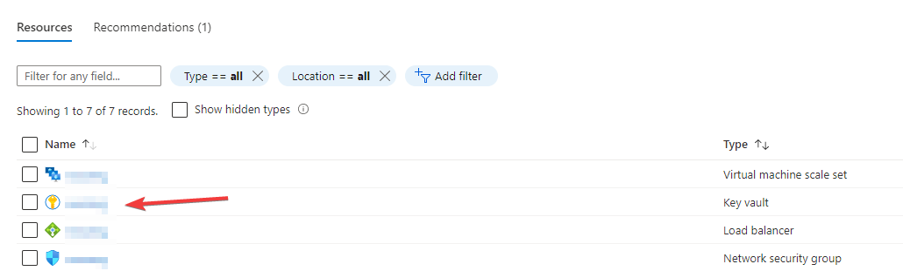
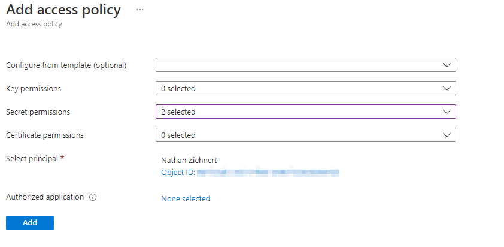
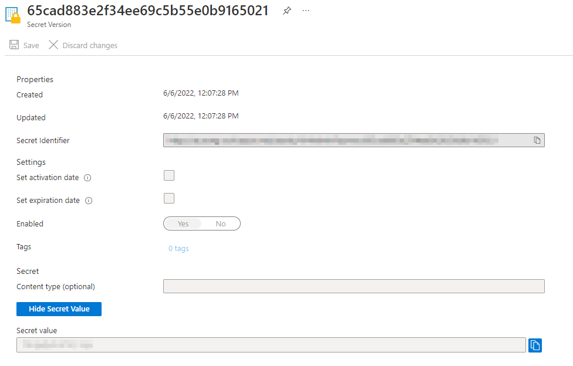
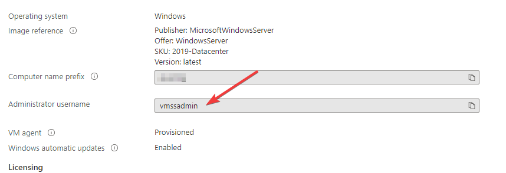
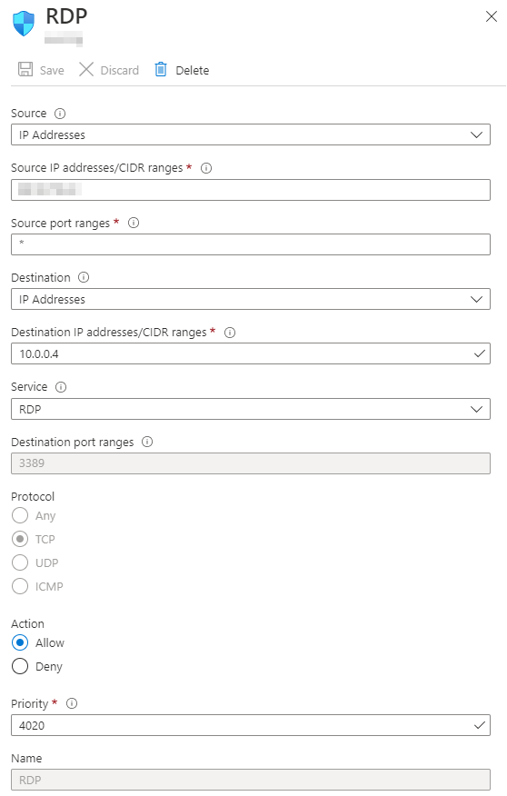
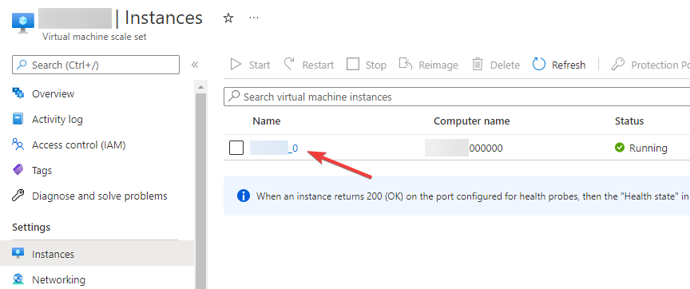
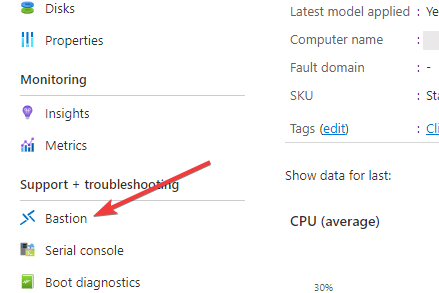
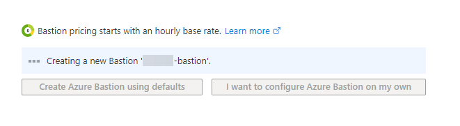
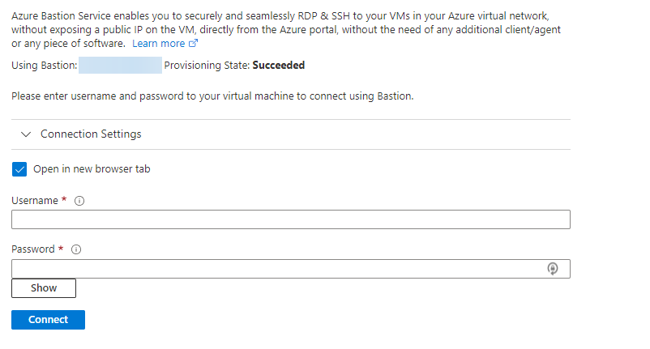

{}
I'm only going to say this once.

This is unsupported. Not recommended. Do NOT do this in production. Do
this only for research in a development/test environment .
{}

## How do I access the Cloud Management Gateway?
Before you move on, read the notice above.

Okay. Promise you read it? Good.

There is never a good reason for you to access the cloud management gateway
via RDP. They just work. If you have issues, rebuild your CMG and move on
to troubleshooting elsewhere in your environment.

However, if you're like me and you like to look at the innerworkings of the
platforms that you're using, well, it is possible. There were a few
different posts on accessing the classic compute based CMG resources, but I
haven't seen a post on accessing the Scale Set based resources, so I'm
writing this.

## Why if it's bad, praytell, did you go looking for a solution?
To tell you the truth, an issue that turned out to be a failed management
point led me to beleive there was something wrong with my **_LAB_** CMG. I 
wanted to look at the IIS logs and validate for myself that the request 
was reaching the CMG because I didn't see anything in my AdminService.log. 
Eventually after rebuilding the CMG I started seeing errors in the 
AdminService.log and I realized that even in this case I never needed to 
look at the CMG directly.

## Enough is enough, I want to peep under the covers... how do I do it?
The process is relatively easy. We need the username and password for the
server and then we need a way to expose RDP. As any good luthier will tell
you, there are multiple ways to make strings out of cat gut.

We can make the RDP port available directly to the web...

Or we can use Azure Bastion.

One is free but super unsecure and unrecommended. The other costs 
money that you're going to need to justify for a lab. Again, I'm going to
reiterate... there's really no reason for you to do this.

### Getting the Username/Password
The first thing we need to do is figure out what the username and password
for the instance(s) are. Conveniently enough, this is stored in an Azure
Key Vault that should have been created when you created your scale set. 
Logon to your Azure tenant (dev or lab... please please don't do this in
production) and then locate the resource group that was used for your CMG.
Within that resource group, there should be a Azure Key Vault named the
same as your CMG instance.

Crack that baby open and realize you don't have any permissions to view
the keys inside. Even if you're global admin. So the first thing we need
to do is change the **Access Policies**. Click on that node, press **Add
Access Policy**, select **Get** and **List** from the **Secret 
permissions** dropdown, select your principal (your user ID or group), and
then press **add**. Then press **Save**.

Now you should be able to click on the **Secrets** node and see the secrets
for your CMG instance - including one called _VMAdminPassword_. Select that
item, select the current version, and press **Show Secret Value**, and
voila... you have your RDP password.

How about that username? Simple. It's just **vmssadmin**. You can validate
this by opening up the _Virtual Machine Scale Set_ in your resource group,
selecting the **Operating System** node, and looking at the **Administrator
username** property.

### Exposing RDP Directly
Okay... another warning... please don't keep this online for any longer
than you need to. Seriously. Open RDP endpoints are absolute ripe for
exploitation. At least set the source address as I'll explain here to
your public IP. Lock it down. But since you're a cheap asshole like me and 
you'd rather risk it than spend a few bucks using a more secure solution, 
read on I guess.

Go back into your resource group and find the **Network security group** 
resource. Open that up and then select the **Inbound security rules** node.
We're going to create a new rule - the source can be a specific IP address
(good for security, you can leave it open, but that's very bad), leave 
**Source port ranges** to *, the destination should be 10.0.0.0/24, change 
the service to **RDP**, and give it a name like **RDP**.

Now this will allow RDP traffic into your scale set. Connecting to your VM 
is now as simple as calling **_cmgfqdn_:50000** from your favorite RDP 
client using the username and password we collected above.

However, if you have more than one VM instance, how do you pick which one 
to connect to? Easy! The ports begin at 50000 and increment by 1 from
there. So instance 2 would be port 50001, 3... 50002, you get the point.

### Connecting via Azure Bastion
Just so you're aware up front, a typical Azure Bastion instance is going to
cost you about $140 USD per month plus outbound transfer costs. Oh, and the
fun part - you can't turn it off. It's up to you to delete the instance or
use some sort of automation to spin up the instance and destroy it when
you're done using it.

However, it really is simple to set it up. My 5 year old could probably do
it accidentally. Funny story, he had the opportunity to sit in the cockpit
of a single prop medical transport plane that was at our local regional
airport one night, and the pilot told him "have at the buttons bud, you
won't be able to do anything I can't fix" and the kid managed to pump fuel
into the engine. Pilot was surprised because it's apparently like a five
button sequence to make that happen.

Anyway, since there's really no reason to do this, keep your money and
don't do it. However, since you've made it this far, my warnings are
obviously going unheeded. We're going to open up our resource group again
and select the **Virtual machine scale set** resource. From here select the
**Instances** node, and then the instance you want to connect to. Lo and
behold, there is a fancy button that says **Bastion**. Press that bad boy
and let's get to work.

You can go through the trouble of configuring the Bastion instance yourself
but because we're not supposed to be doing this anyways, let's just go
ahead with the defaults. Press that **Create Azure Bastion using defaults**
button and away we go! Literally. No warnings or anything.

Now three things get created by default here

1. A new subnet on your CMG virtual network named **AzureBastionSubnet**
2. A new Public IP address
3. A new Bastion instance

Just remember to delete both items when you're done. It should take a few
minutes to provision everything. Once provisioned use the username and
password we collected at the beginning of this post and send it!

## Conclusion
Reminder that you really don't ever need to do this. Plenty of logs exist
to troubleshoot your instance, and if you're in doubt just rebuild the
scale set. However, if you want to tinker in a lab and see what everything
looks like under the hood, then by all means... it's your VM!