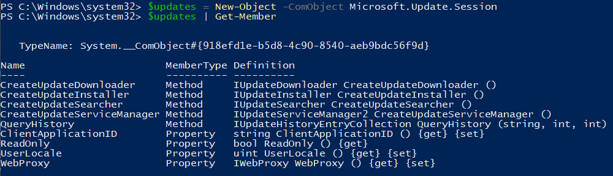

## Tale as old as time
At some point in the somewhat distant past, a group of engineers at Microsoft 
got together, rolled a blunt, and said to themselves, "You know how everyone 
hates Windows Updates? Well we do too. Brothers and sisters it is time to
unshackle the Microsoft Office platform from its update prison! No longer will
we accept the bondage of publishing multiple updates monthly. Let us create a 
new platform where the entire application suite is updated at one time! Let us
create utopia!"

I'm not saying they were wrong. Some of the best music was conceived in a
similar, less than legal manner. However, at some point later the filthy systems 
administrators came back into the picture and said, "Dudes and dudettes. This is 
cool and all, but you know we'd really still like a way to deliver the content 
from our own servers and manage when these updates get applied to our devices. 
Not that we don't trust you or anything - I mean your track record is absolutely
flawless - it's just... well, you know, our bosses... and stuff."

And thus, the Office Click-To-Run COM Interface was born.

The OfficeC2RCOM Interface serves as way for manageability applications (MEMCM, 
Intune, Tanium, etc.) to instruct OfficeClickToRun.exe:

1. When to download updates
2. Where to download updates from
3. What updates to download
4. When to install updates

Of course this is only half of the battle. Nobody wants to have yet another
platform to manage these questions, so updates were yet again published to the
dreaded Microsoft Update Catalog / WSUS. However, unwilling to publish all bits 
and bytes necessary to cumulatively update an Office installation to the 
Microsoft Update CDN, the engineers took a different approach. The content would
continue to be delivered from the Office CDN, but metadata would be published to
Microsoft Update / WSUS with instructions that could be consumed by a
manageability application to answer questions 2 and 3 from above.

## How does it work?
I'm going to provide less detail here for simplicity sake - and we're going to
focus on how this works in a MEMCM+WSUS style environment. The basic steps are:

1. The appropriate M365 Apps updates are synchronized from Microsoft Update into
WSUS. These are separated by channel, architecture, and version.
2. This update contains metadata in the "More information" property of the
update. Specifically a link to an API that informs the manageability application
from where it can get the content necessary to update Office (if it wishes to
store and deliver the content itself rather than the Office CDN).
3. The manageability client downloads and stages this content in its
distribution servers (or not... depending on configuration).
4. Admins approve the update for specific machines.
5. When the machine checks in for updates it determines applicability of the
Office update as it would any other Windows update
6. If the update is applicable - instead of installing the update like a Windows
update, the manageability application then kicks back in and makes a call to the
OfficeC2RCOM Interfaces to download the content from its own distribution
channels or from the Office CDN.
7. Once the content is downloaded, the Office client then presents a ribbon to
the end user notifying them that an update is ready to be installed but Office
apps must be closed to do so. It is also possible for the manageability
application to force the "Apply" action here, but doing so requires the Office
apps to be closed in 99% of cases. Depending on the configuration of the
manageability application it may wait or it may force the apps to close.
8. Presto, chango... Office is updated!

This is summarized in the following flowchart I ~~stole~~ borrowed from
Microsoft:


## Time to do stupid stuff
Those of you who know me know that ~~occasionally~~ often I like to write code
and scripts just to prove that I _can_ do something even if I don't _need_ to
do something. Part of me just likes to see how things work by making them work
in unconventional or unnecessary ways. So I asked myself (never a good place to
start), could I manage an Office installation the same way that MEMCM manages it
_without MEMCM_?

The answer to this question is yes, although the path to get there was painful.

The documentation for this interface is "available" albeit limited and frankly
lacking: [Integrating manageability applications with Microsoft 365 Apps Click-to-Run installer](https://docs.microsoft.com/en-us/office/client-developer/shared/manageability-applications-with-the-office-365-click-to-run-installer)

The methods we're interested in are:
- Apply(string Parameters): Applies/installs updates based on the parameters
sent to the method.
- Download(string Parameters): Downloads updates based on the parameters sent to
the method.
- Status([out]UpdateStatusReport): Outputs the current state of the COM object
(downloading, downloaded, applying, applied, etc.)
- GetBlockingApps([out]string BlockingApps): Outputs the blocking applications
that would keep an install from completing, comma-separated

<u>**COM Objects**</u></br>
The first thing we have to tackle is COM Objects. Now if we write a PowerShell
script to interface with the Windows Update Agent, for example, we have an easy
path to do this - because it publishes a well-known Program Identifier
(Microsoft.Update.Session) and this object has well defined methods/interfaces:



However, the Office Click-To-Run COM Object doesn't. Wading through the
documentation, you eventually come across a GUID that could be used to create
the COM object: _{52C2F9C2-F1AC-4021-BF50-756A5FA8DDFE}_. So we can do some
creative work to create this object (UpdateNotifyObject2) in PowerShell 
by borrowing some .NET methods:

```PowerShell
$clsid = [guid]::new("52C2F9C2-F1AC-4021-BF50-756A5FA8DDFE")
$type = [Type]::GetTypeFromCLSID($clsid)
$object = [Activator]::CreateInstance($type)
$object | Get-Member
```

Unfortunately, when we look at the output of the above we don't have any useful
methods. It's basically just the default junk for a ComObject. This is where my
knowledge of COM is lacking, but I believe this is because the object 
(UpdateNotifyObject2) doesn't publish any methods, and while those method 
definitions are contained in the interface (IUpdateNotify2), we don't have a
definition of this interface to cast to the object. In case you're confused,
don't worry... it's about to get even more confusing if you don't have any
background or experience in C#. It's about to get even more confusing because
I'm probably not even using the correct terminology.

<u>**C# and InteropServices**</u></br>
Now we have to break out the big guns. Essentially what we have to do is make
some calls to "unmanaged" code (code that runs outside of the CLR - COM objects)
through the use of InteropServices. You may have come across this before when
trying to do something like make a window full size. You add some "C# Code" in a
here string, and then call the "Add-Type" cmdlet in PowerShell to "compile" the
code and add those namespaces/classes to the PowerShell instance.

The key pieces we have to define are:

1. Our using statements (System and System.Runtime.InteropServices)
2. Importing and creating a definition for the IUpdateNotify2 interface. An
interface is like a contract - it says "what you need to do" without defining
"how" you do it. An interface might say "bool IsThisTrue(bool Value)", but the
implementation (the "how") would include the code necessary to perform the work 
of that method.
3. Importing and creating a class for UpdateNotifyObject2. This is the "object"
that we'll work with.
4. Creating the enumerations and structs that are required by the interface.
5. Creating a class to expose the functions. This part may seem odd, but for
whatever reason, I could not cast the UpdateNotifyObject2 as an IUpdateNotify2
type in PowerShell directly. This also ends up making it a bit easier to work
with in PowerShell, so I'm not complaining.
6. The instructions in the documentation say that you should create a new
instance of the COM object for every method call you make because it times out
after a short period of time. Creating a new instance will look first to see if
there is an existing instance and use that, otherwise it will create a new
instance. We take this into consideraiton in the class that we create in step 5.

I'm not going to walk through each of these steps individually - you can see the
code at the end of this post, and I'm happy to answer questions about it in the
comments.

<u>**"Compiling" C# Code in PowerShell**</u></br>
As I said earlier, you may have done this before. The basic steps are to create
a here string with the code that we just wrote, and call the "Add-Type" cmdlet
to "compile" the code and make the namespace/classes available to us in the
PowerShell session.

```PowerShell
$code = @"
   <our fancy c# code>
"@
Add-Type -TypeDefinition $code -Language CSharp
```

We should now be able to access the code we created by calling it how we'd call
any other .NET Namespace/Class/Method:

`[_Namespace_._Class_]::Method(parameters)`

## Using our ComObject
Now if you "borrow" the code that I put at the end of this post, the namespace
is "OfficeC2RCom", the class we'll primarily focus on is "COMObject", and the
methods are "Download", "Apply", "GetBlockingApps", and "GetCOMObjectStatus"

<u>**Download(string parameters)**</u></br>
This is arguably the most important method we want to call. This method handles
the download of the content from the Office CDN, and takes a single string
parameter. This parameter accepts:

- displaylevel: (true/false) to show the installation status (although in my 
testing it doesn't actually display anything for download)
- updatetoversion: (16.0.xxxxx.yyyyy) this is the important one - we can pass a 
specific version to update/downgrade to
- updatebaseurl: not used for the time being as we don't have a download source
other than the Office CDN
- downloadsource: not used for the time being as we don't have our own BITS
manager
- contentid: not used for the time being as we don't have our own BITS manager

This string should be formatted like: `"displaylevel=false 
updatetoversion=16.0.xxxxx.yyyyyy"` where it's parameter=value pairs separated 
by spaces. 

We call this by executing the following line after we add the type:

```PowerShell
[OfficeC2RCom.COMObject]::Download("updatetoversion=16.0.xxxxx.yyyyy")
```

<u>**GetCOMObjectStatus()**</u></br>
This is the second most important command. We can only call the Download and
Apply methods when the COMObject is in a specific state. These acceptable states
are defined in [the docs](https://docs.microsoft.com/en-us/office/client-developer/shared/manageability-applications-with-the-office-365-click-to-run-installer).

We can use this method to determine the current state and decide whether or not
we can proceed, or if the method we called (like Download) is complete. We call
this by executing the following line:

```PowerShell
[OfficeC2RCom.COMObject]::GetCOMObjectStatus()
```

This outputs JSON, so you can pipe the output to ConvertFrom-JSON, to have an
object to work with. You'll have both the "exit code" of the current state and
the name of the current state.

<u>**Apply(string parameter)**</u></br>
This method is only recommended if you plan on monitoring for the status of
Office executables and takes a single parameter. This parameter accepts:
- displaylevel: (true/false) to show the installation status 
- forceappshutdown: (true/false) this will forceably shutdown the Office apps even if the
user is actively using them... not recommended

Call this with the following code: 
```PowerShell
[OfficeC2RCom.COMObject]::Apply("displaylevel=false forceappshutdown=false")
```

<u>**GetBlockingApps()**</u></br>
This method outputs a string array of the running applications that
would block Office from updating if you call the Apply method without the
_forceappshutdown_ parameter set to true. 

Call this with the following code: 

```PowerShell
[OfficeC2RCom.COMObject]::GetBlockingApps()
```

<u>**An "Example"**</u></br>
You might utilize this code in a script like this to download, monitor, and
apply the updates:

```PowerShell
[OfficeC2RCom.COMObject]::Download("updatetoversion=16.0.15225.20370")

$downloading = [OfficeC2RCom.COMObject]::GetCOMObjectStatus() | ConvertFrom-JSON
while($downloading.status -eq "eDOWNLOAD_WIP"){
  Start-Sleep -Seconds 1
  $downloading = [OfficeC2RCom.COMObject]::GetCOMObjectStatus() | ConvertFrom-JSON
}

if($downloading.status -eq "eDOWNLOAD_SUCCEEDED"){
  [OfficeC2RCom.COMObject]::Apply("displaylevel=true forceappshutdown=true")
}

$installing = [OfficeC2RCom.COMObject]::GetCOMObjectStatus() | ConvertFrom-JSON
while($installing.status -eq "eAPPLY_WIP"){
  Start-Sleep -Seconds 1
  $installing = [OfficeC2RCom.COMObject]::GetCOMObjectStatus() | ConvertFrom-JSON
}

Write-Output "Download and Installation Complete? Last known status: $($installing.status)"
```

Admittedly this is a pretty poor and not well thought out example, but you get
the picture I hope.

## I don't care about fluff, give me the code
If you read all the way through to get here, I'm impressed. If you clicked the
link at the top to get here - well, I don't blame you. The latest version of my
code is available on my GitHub repo here: [OfficeC2RCom.ps1](https://github.com/theznerd/RandomPowerShell/blob/master/OfficeC2RCom.ps1)

I've also pasted it here for posterity and SEO, but this may not be as up to 
date as the GitHub repo:

```PowerShell
$OfficeCOM = @"
using System;
using System.Runtime.InteropServices;

namespace OfficeC2RCom
{
    [ComImport]
    [Guid("90E166F0-D621-4793-BE78-F58008DDDD2A")]
    [InterfaceType(ComInterfaceType.InterfaceIsIUnknown)]
    internal interface IUpdateNotify2
    {
        [return: MarshalAs(UnmanagedType.U4)]
        uint Download([MarshalAs(UnmanagedType.LPWStr)] string pcwszParameters);

        [return: MarshalAs(UnmanagedType.U4)]
        uint Apply([MarshalAs(UnmanagedType.LPWStr)] string pcwszParameters);

        [return: MarshalAs(UnmanagedType.U4)]
        uint Cancel();

        [return: MarshalAs(UnmanagedType.U4)]
        uint status(out UPDATE_STATUS_REPORT pUpdateStatusReport);

        [return: MarshalAs(UnmanagedType.U4)]
        uint GetBlockingApps(out string AppsList);

        [return: MarshalAs(UnmanagedType.U4)]
        uint GetOfficeDeploymentData(int dataType, string pcwszName, out string OfficeData);

    }

    [ComImport]
    [Guid("52C2F9C2-F1AC-4021-BF50-756A5FA8DDFE")]
    internal class UpdateNotifyObject2 { }

    [StructLayout(LayoutKind.Sequential)]
    internal struct UPDATE_STATUS_REPORT
    {
        public UPDATE_STATUS status;
        public uint error;
        [MarshalAs(UnmanagedType.BStr)] public string contentid;
    }

    internal enum UPDATE_STATUS
    {
        eUPDATE_UNKNOWN = 0,
        eDOWNLOAD_PENDING,
        eDOWNLOAD_WIP,
        eDOWNLOAD_CANCELLING,
        eDOWNLOAD_CANCELLED,
        eDOWNLOAD_FAILED,
        eDOWNLOAD_SUCCEEDED,
        eAPPLY_PENDING,
        eAPPLY_WIP,
        eAPPLY_SUCCEEDED,
        eAPPLY_FAILED
    }

    internal enum UPDATE_ERROR_CODE
    {
        eOK = 0,
        eFAILED_UNEXPECTED,
        eTRIGGER_DISABLED,
        ePIPELINE_IN_USE,
        eFAILED_STOP_C2RSERVICE,
        eFAILED_GET_CLIENTUPDATEFOLDER,
        eFAILED_LOCK_PACKAGE_TO_UPDATE,
        eFAILED_CREATE_STREAM_SESSION,
        eFAILED_PUBLISH_WORKING_CONFIGURATION,
        eFAILED_DOWNLOAD_UPGRADE_PACKAGE,
        eFAILED_APPLY_UPGRADE_PACKAGE,
        eFAILED_INITIALIZE_RSOD,
        eFAILED_PUBLISH_RSOD,
        // Keep this one as the last
        eUNKNOWN
    }

    public static class COMObject
    {
        static IUpdateNotify2 updater;
        static UPDATE_STATUS_REPORT report;

        public static uint Download(string parameters = "")
        {
            updater = (IUpdateNotify2)new UpdateNotifyObject2();
            return updater.Download(parameters);
        }

        public static uint Apply(string parameters = "")
        {
            updater = (IUpdateNotify2)new UpdateNotifyObject2();
            return updater.Apply(parameters);
        }

        public static string GetCOMObjectStatus()
        {
            updater = (IUpdateNotify2)new UpdateNotifyObject2();
            updater.status(out report);

            return "{ \"status\":\"" + report.status + "\", \"result\":\"" + report.error + "\"}";
        }

        public static string[] GetBlockingApps()
        {
            string blockingApps;

            updater = (IUpdateNotify2)new UpdateNotifyObject2();
            updater.GetBlockingApps(out blockingApps);
            return blockingApps.Split(',');
        }
    }
}
"@
Add-Type -TypeDefinition $OfficeCOM -Language CSharp
```