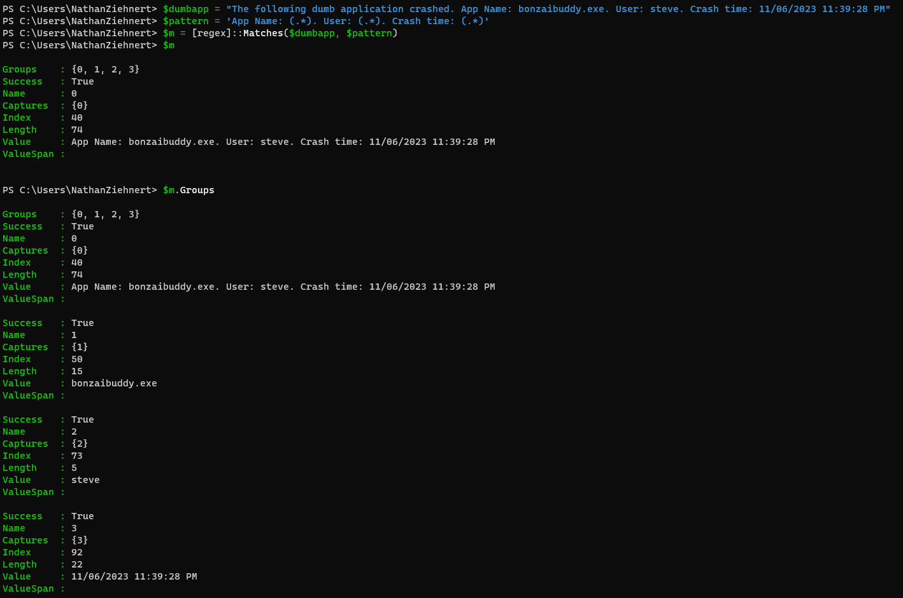
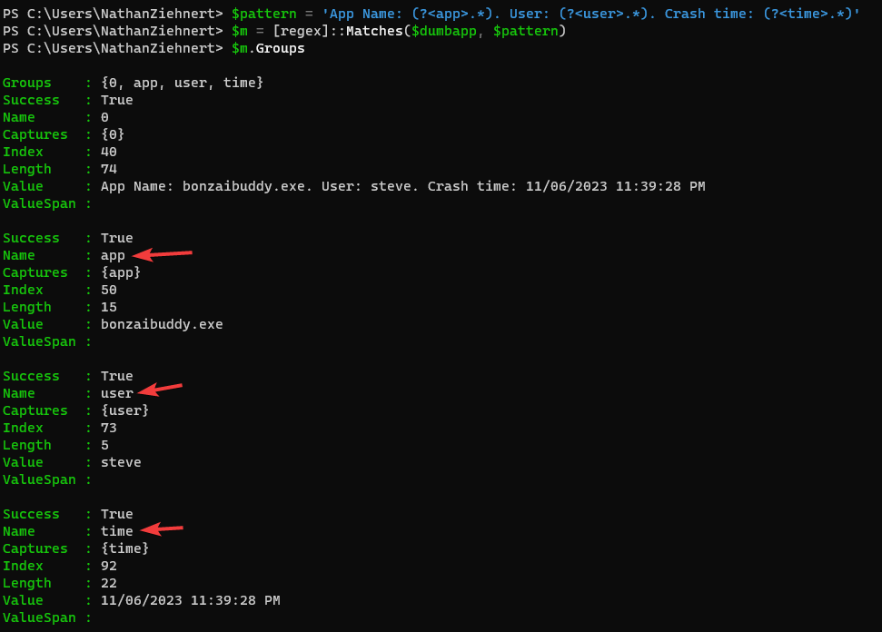

## Hello, is it me you're looking for?
God I hate regex.

But everytime I try to get away from it, it pulls me right back in. So if I have to
use it, I'm going to make you all use it too. There are a million and one different
tutorials on learning regex, and a multitude of great tools at your disposal to help
you build your regex patterns. I'm not here to guide you through the basics, hell, I
have to look up anything beyond `.*` everytime I try and do anything other than find
a basic string. For posterity however, here are a couple of my favorite tools:

- [regex101.com](https://regex101.com) (test to your little heart's content)
- [regexper.com](https://regexper.com/) (unfortunately not helpful with named captures)

No, the purpose of this particular blog post is going to be walking through capture
groups. If you don't want to read my incessant ramblings, Microsoft does a pretty bang
up job going over things in the [documentation](https://learn.microsoft.com/en-us/powershell/module/microsoft.powershell.core/about/about_regular_expressions?view=powershell-7.3#groups-captures-and-substitutions).
Or you can read Kevin Marquette's [extensive explanation](https://powershellexplained.com/2017-07-31-Powershell-regex-regular-expression/).

## regex 101
Okay, I lied. Just a little. Just to make sure we're all on the same page. Regex was
created to ~~piss a whole lot of people off~~ find match(es) in strings using
~~the most heinous logic possible~~ very intuitive syntax like multiple different types
of wildcards, greedy or lazy matching, grouping, character classes, the list goes on.
The more complicated your pattern, the more money you stand to make in a job at one of
the FAANG companies (who knows, maybe someday you'll be posting on Reddit about
whether you should accept your new $750k/yr salary, but aren't sure because you only
get 25k stock options).

Regex is supported in a few of the native operators/cmdlets in PowerShell:

- Select-String
- -match/-cmatch and -replace/-creplace
- -split/-csplit
- switch (using the -regex parameter)

Something to consider with the built-in cmdlets is that unlike default(?) regex, 
they're case-INsensitive by default, although you can change this. The operators 
(match, replace, and split) all have case sensitive counterparts (cmatch, creplace, 
csplit).

You can also use the regex type accelerator: `[regex]` with all the power and speed of
.NET Framework or dotnet (depending on which flavor of PowerShell you are running).

Got it? Good. Let's move on.

### cmdlet vs [regex]
Why use Select-String or -match over `[regex]`? Why use `[regex]` over Select-String?
I suppose you might see some appreciable difference in speed between them (quite often
type accelerators work faster than their cmdlet counterpart, but not always). Also, I 
have this weird hangup about using the `-match` operator because the functionality 
changes based on when you use an array vs using a single string object. Also in the 
case of a single string match, it places the match(es) in an automatic variable named 
`$matches`. This is a me thing, but I don't like the use of the automatic variable.

Ultimately, it comes down to what you're trying to do, what is easiest for you to do,
and most of all, what is the most readable for future ~~really pissed off that you 
didn't document your code~~ you.

## On with the show. Grouping. Or Captures. Or Whatever.
Envision a sentence in a log file (I don't know, make something up) that was made up of
a well structure number of data points. Of course the developers didn't want to log
it across multiple lines, but they did want to communicate some super useful info.
Since I'm guessing I didn't give you enough time to make something up, here is one:

`The following dumb application crashed. App Name: bonzaibuddy.exe. User: steve. Crash time: 11/06/2023 11:39:28 PM`

Now we could certainly do some creative subselecting with indexing to find the index of
the "App Name", then grab the text between it and the the word "User", then find the
index of "User", and grab... blah blah - you get the point. It would be an absolute
mess of nested IndexOf's and Substrings... just a pointless nightmare.

We could also do multiple regex queries to find the individual pieces we were looking
for. But regex can be expensive... and doing it 3 times for each line? We should have
a way to get three data points in one ~~simple~~ query.

Capturing groups. We need capturing groups. So how do we make one? Just put whatever
you wish to capture inside parenthesis `()`. So for our above complicated example the
regex pattern might look like so:

`'App Name: (.*). User: (.*). Crash time: (.*)'`

Let's break the above example down. Here we have three separate capture groups - all wildcards, which are broken up by our known text fields `"App Name: "`, `". User: "`, and `". Crash time: "`. What does this look like in PowerShell?



As you can see, we're provided with a member called "Groups" that gives us the
invidivual values within the capture group. Little cages to catch our unsuspecting
rats. In my example I used the type accelerator, but this works equally as well with
`Select-String`. Accessing the groups is a little different, but I leave that to you
to learn my friend.

## Named Captures, use them.
The above is pretty cool, but accessing the data in a 0-indexed array violates my
principles of readable code. I don't ever want to see 
`$matches.Groups[1].Value` in someone's code... even if it is commented. You
don't want to see it ~~15 minutes~~ 5 years later and wonder "what in the ever living
\*\*\*\* was I getting here?" So let's name our captures! This is _actually_ simple
syntax: `?<name>` and you put it in the capture group.

Using the above example, let's add some names to our captures:

`'App Name: (?<app>.*). User: (?<user>.*). Crash time: (?<time>.*)'`



Bingo bango. Now we can access them by name - however, to do this we need to specify
the 0-index group (at least when using the type accelerator): 
`$ouputVar.Groups[0].Groups['app'].Value`. If you're using `-match` and `$matches` you
can just use the name in the dot parameter like so: `$matches.app`. Be aware however, 
that `-match` only grabs the first occurance. (Another point for the type accelerator 
or Select-String teams). Which slides me right into home for this post.

## Multiple Matches
"But Nathan," I hear you say, "I have this massive string of text, and I want to grab
ALL of my matches, not just one!" There are (at least) two possibilities here:

- You have a set of data, and you want to pull out all matches.
- You have a set of data, and you want to pull out all matches, but then capture specific
data inside each match.

Both are possible - provided you're not using the -match/-cmatch operators. The simple
case is just to create a generic match pattern like so:

```
$string = "this is repeated text. this is repeated text. this is repeated text."
$pattern = 'repeated'
$m = [regex]::Matches($string, $pattern)
$m
```

This will return all matches that are found to the designated pattern. Note, however,
when using `Select-String` you need to specify the `-AllMatches` parameter:

```
$string = "this is repeated text. this is repeated text. this is repeated text."
$pattern = 'repeated'
$m = $string | Select-String $pattern -AllMatches
$m
```

Now in the case you want to group data... say you want to scrape all of the data from
a webpage and gather all the links (there are better ways to do this, but I digress).
You can create nested capture groups like so:

```
$string = @"
11/06/2023 12:39:38 AM The following stupid app quit: bonzaibuddy.exe
11/06/2023 12:43:32 AM The following stupid app quit: linkinpark_intheend.mp3.exe
11/06/2023 1:22:15 AM The following stupid app quit: credit_card_scraper.exe
"@
$pattern = '((?<date>.*?) The following.*?: (?<app>.*?$))'
$m = [regex]::Matches($string, $pattern, 2)
$m
```

Notice the introduction of the integer 2 above. This parameter expects an enum value
that corresponds to the available [RegexOptions](https://learn.microsoft.com/en-us/dotnet/api/system.text.regularexpressions.regexoptions?view=net-7.0)
to change how the match is performed. In this case "2" indicates that we're dealing
with multi-line data and the ^ (beginning of string) and $ (end of string) operators
should respect new lines as a new string. `Select-String` works a little differently,
as it takes data from the pipeline - instead of passing a single string object you
should pass an array of strings (one per line) to `Select-String`.

## Enough for Now
Hopefully this gives you a good start to playing around with capture groups in regex
and PowerShell. The above examples are given for reference, but don't consider them
as well thought out or efficient patterns. The way you structure your regex pattern 
can have a significant performance impact (measureable in some of the online tools 
based on the number of steps needed to evaluate). I encourage you all to at least
have a basic familiarity with regex, as much as everyone loathes it, because it can
prove to be a valuable asset in doing important things with large amounts of text
or even validating parameters on your PowerShell scripts (another topic for another
day). 

Happy admining!