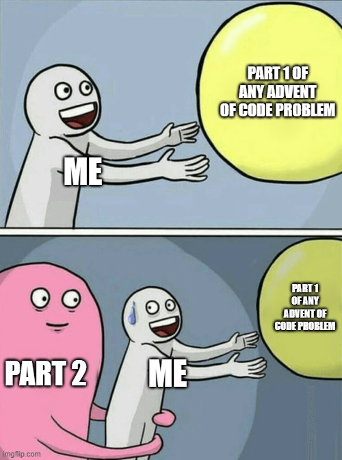

## And We're Off... to a rough start
I was very excited to blast through last night's problem and get a decent night's sleep.
Advent of Code had other plans.


Yesterday seemed simple enough, it was even easy to guess what the second half problem
modification was going to be. However, the example data didn't use the "edge" case that
many people had to deal with in ~~frustration~~ elation.

Here's my solution - we'll break down parts one and two after the break. [GitHub](https://github.com/theznerd/AdventOfCode/tree/main/2023/01)

## Part 1 - A Little Help from My (Regex) Friend
Part one was easy enough - grab the first and last single digit integer from each string,
combine them into a two digit number (meaning if there was only one, double it), add up
all the values, and there's your answer.

This will be a common refrain over all these blogs but: I'm sure there are better/faster
ways to do this. Regex matching all single digit integers is easy enough 

```PowerShell
$regx = [Regex]'\d'
$numbers = $regx.Matches($string)
```

If you follow me on LinkedIn/BlueSky I posted some tips/tricks about accessing array
objects by index - so grabbing the first and last match is easy. This even has the
benefit of doubling the entry if there is only one match. We combine both into an
`int` and bob's your uncle, we add all the values together:

```PowerShell
# [0] gives us the first match, [-1] gives us the last match
[int]"$($numbers[0].Value)$($numbers[-1].Value)"
```

We didn't have too many "lines" to parse through, so no real need for crazy optimization.
However, the strings had random characters, but often those "random" characters were the
dictionary word for the numbers (one, two, three). You can guess what comes next...

## Part 2 - Wait, there's something that Regex doesn't do natively?
Part two sounded easy on paper. You just need to convert the dictionary words in the string
to an integer and then we'll just grab the first and last integers again. However, you do
this, then submit your answer, and you realize you forgot to account for a problem. A few
of the numbers share a letter at the beginning or the end (threEight, twOne, etc.) So if
you do a replace, you end up getting something like `3ight` or `2ne`. Hmm...

Since we only care about the first number and last number, we really only need to find the
first one and the last one and then replace with the number. Cool, so finding the first
match and replacing is easy:

```PowerShell
$regx = '(one|two|three|four|five|six|seven|eight|nine)'
$newString = $string -replace $regx, {"$([int][singleDigits]::$($_))$_"}
```

What is `[singleDigits]`? It was just a quick enum so that I could pass the text value to
it and get it's integer representation. It's super basic:

```PowerShell
enum singleDigits {
    zero
    one
    two
    three
    four
    five
    six
    seven
    eight
    nine
}
```

So the above replaces the first match based on the Regex string, with the int value AND the
original value. So `eight18` would return `8eight18`. Why keep the original number? Well we
may still need it to find the last number if they overlap (remember from above).

Great, so we've replaced the first match, it should be easy to replace the last match with
Regex right? Well Regex doesn't find the last match very well. PowerShell master Chris Dent 
did show me how you can set the dotnet Regex searcher to work from right to left like this:
`[Regex]::Matrch($string, $pattern, 'RightToLeft')`. Of course I didn't consider that was
an option (should have [read the documentation](https://learn.microsoft.com/en-us/dotnet/api/system.text.regularexpressions.regexoptions?view=net-8.0)).
In my infinite wisdom late at night I just said, well, let's iterate through all the matches
and find out which one has the highest index, and then do a little substring mumbo jumbo. It's
ugly (and I admit in my code that I don't like it).

```PowerShell
function Update-Digits ($string) {
    $regx = '(one|two|three|four|five|six|seven|eight|nine)'
    $newString = $string -replace $regx, {"$([int][singleDigits]::$($_))$_"}
    
    ## Ugh... reverse matching? I don't like this solution...
    $words = "one", "two", "three", "four", "five", "six", "seven", "eight", "nine"
    $lastIndex = -1
    $lastLength = 0
    $lastValue = ""
    foreach($word in $words)
    {
        $index = $newString.LastIndexOf($word)
        if($index -gt $lastIndex){$lastIndex = $index; $lastLength = $word.Length; $lastValue = $word}
    }
    if($lastIndex -eq -1){
        return $newString
    }
    if($lastIndex -eq 0){
        return "$([int][singleDigits]::$lastValue)$($newString[($lastLength)..($newString.Length)] -join '')"
    }
    if($lastIndex -gt 0){
        return "$($newString[0..$lastIndex] -join '')$([int][singleDigits]::$lastValue)$($newString[($lastIndex + $lastLength)..($newString.Length)] -join '')"
    }
}
```

So in the end it works... but I'm not happy with it

## Day 2 - Part 2 - Attempt 2
After some caffeine and thought, I realized I overthought the whole shebang. I could just
do what I did for part 1, but this time capture all the string matches (including overlaps):

```PowerShell
$regx = [regex]'(?=(one|two|three|four|five|six|seven|eight|nine))'
$numbers = $regx.Matches($string)
```

Then if I find any matches, replace the first and last (again utilizing the negative index)
and just put the numbers in place (accounting for a +1 to the index for the second number 
since we're adding a character to the string for the first number). No weird replaces or a 
bunch of substring junk:

```PowerShell
function Update-Digits ($string) {
    $regx = [regex]'(?=(one|two|three|four|five|six|seven|eight|nine))'
    $numbers = $regx.Matches($string)
    if($numbers)
    {
        $firstMatch = $numbers[0].Groups[1].Value
        $firstIndex = $numbers[0].Groups[1].Index
        $lastMatch = $numbers[-1].Groups[1].Value
        $lastIndex = $numbers[-1].Groups[1].Index
        return $string.Insert($firstIndex, [int][singleDigits]::$firstMatch).Insert(($lastIndex + 1), [int][singleDigits]::$lastMatch)
    }
    return $string
}
```

Not sure this is anymore performant, but honestly it feels cleaner and it runs fast enough.
So I can close this day in my head and sleep well until 12AM Eastern when Day 2 really starts.

Thanks for tagging along with my crazy thought process and until next time, Happy Scripting!