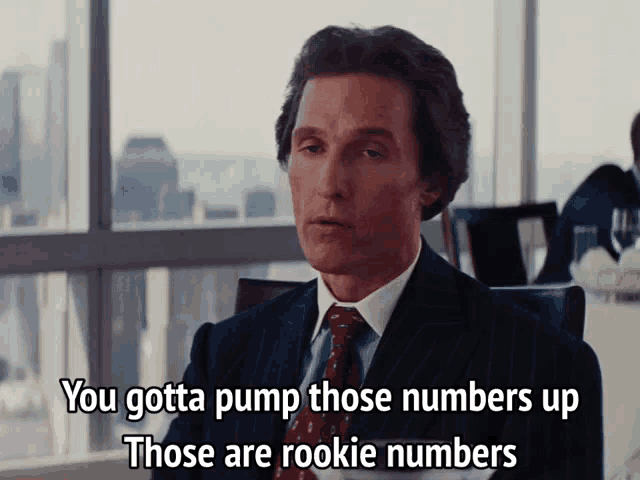

## Oops... killed the streak.

Welcome back to my weekly (current streak: 2) PowerShell post. 

Continuing with our Advent of Code fun we're back at it with big numbers
again. This time with big ranges. If you're still working with `[int]`
for this puzzle, well then the only thing I have to say to you is:



My solutions here: [https://github.com/theznerd/AdventOfCode/tree/main/2025/05](https://github.com/theznerd/AdventOfCode/tree/main/2025/05)

## This Inventory System is Dumb.

Okay - this seems pretty straightforward. We've got a bunch of ranges, and
separately we've got a bunch of ingredients. If an ingredient ID is within
any of the ranges, then the ingredient is fresh and we can keep it. The
ranges are inclusive (top and bottom of the range are included), and some
of the ranges may or may not overlap. I like to quickly see what I'm up
against for part two of the puzzle, so if there is a way to get there
quickly (even if not optimally) then I'm all for that route.

> "We can optimize the code later" 
> <br/>&nbsp;&nbsp;&nbsp;&nbsp; \- every developer creating tech debt

The numbers in our puzzle input include things well outside of the range
for `[int]` - so we know we're going to want to cast them to `[long]` or
something similar that has a big space. We'll create an array or arrays
of all of our ranges like this:

```PowerShell
foreach($freshID in $freshIDs -split "`r`n")
{
    $rangeStart, $rangeEnd = $freshID -split "-"
    $freshIDRanges += ,@([long]$rangeStart, [long]$rangeEnd)
}
```

I can already hear you ask - why is there a comma in front of that
array on line 4? It's the [Unary Comma Operator](https://learn.microsoft.com/powershell/scripting/lang-spec/chapter-07?#721-unary-comma-operator)
and it is going to prevent the array `@([long]$rangeStart, [long]$rangeEnd)` 
from unrolling so that our `$freshIDRanges` array is truly an array 
of arrays and not just a flat array of `[long]`s. By the way, the
Language Specification documentation that I linked above here is
a good way to find out things you might not know about how PowerShell
works. It's a lot of reading, and frankly I don't think it's necessary
for everyone to read in full (I've not had the pleasure either), but
whenever you see someone do something interesting in a script, there's
a good chance it's documented somewhere in this specification.

Okay great. So now we have our array of ranges. Now we can loop through
all our ingredients and test whether they are within the boundary of the
range. Since there are a lot of ranges, and some overlap, it makes sense
for us to dump out of our loop as soon as we find a match. We'll do this
using a [labeled continue](https://learn.microsoft.com/powershell/module/microsoft.powershell.core/about/about_continue#using-a-labeled-continue-in-a-loop)
inside of our loop.

```PowerShell
:ingredient foreach($ingredient in $availableIngredients -split "`r`n")
{
    foreach($range in $freshIDRanges)
    {
        if([long]$ingredient -ge $range[0] -and [long]$ingredient -le $range[1])
        {
            $freshIngredients++
            continue ingredient
        }
    }
}
```

Why a labeled loop here instead of just continue? Well, we're two loops deep
at this point in our code, right? If we were just to continue, we'd continue
on the next range in the `$freshIDRanges` which is the behavior we're trying
to avoid here. By continuing at ingredient, we stop evaluating the ranges
and continue on to our next ingredient. It saves quite a bit of time since
we don't need to continue testing ranges if we already found a match.

So, the problem is solved and the elves now know what ingredients they need
to throw out. However, there's always a catch.

## We'd Really Hate To Bother You

You can sort of predict these second parts when you spend a couple years 
doing Advent of Code puzzles. Of course the elves are polite and don't wish
to keep asking you if an ingredient is spoiled or fresh, so they've asked
you to give them a list of ALL of the ingredients that are fresh so they
can check. That's gonna be one hell of a list.

Luckily, the puzzle masters did not make us generate such a list, and
instead wisely asked us - exactly how many ids would be in this list if
you were to generate it? That is much easier (and requires much less
memory).

For those of you who know me, you know that I like classes in PowerShell.
Especially when it comes to sorting (because it's realtively easy to
implement the `IComparable` interface). The plan here is to create a
list of Range objects (that we create), sort them, merge them until we
can't merge no more, and then for the remaining ranges get the total of
the values in the range (rangeEnd - rangeStart + 1 [to account for the
inclusiveness]).

The class to implement IComparable looks like this:

```PowerShell
class Range : IComparable {
    [long]$Start
    [long]$End
    Range([long]$start, [long]$end){
        $this.Start = $start
        $this.End = $end
    }

    [int]CompareTo($other) {
        if ($this.Start -lt $other.Start) { return -1 }
        if ($this.Start -gt $other.Start) { return 1 }
        return 0
    }
}
```

Now why are we implementing `IComparable`? Well, if we sort our ranges
by the start range, we can reduce the number of ranges we need to check
for overlap (previous ranges in the search start earlier, so if there
were an overlap it already would have been merged). 

Next we create the list of ranges and then sort it:

```PowerShell
$freshIDRanges = [Collections.Generic.List[Range]]::new()
foreach($freshID in $freshIDs -split "`r`n")
{
    $rangeStart, $rangeEnd = $freshID -split "-"
    $freshIDRanges.Add([Range]::new([long]$rangeStart, [long]$rangeEnd))
}
$freshIDRanges.Sort()
```

Notice that we don't have to do something like `$freshIDRanges = $freshIDRanges.Sort()`.
When calling the `Sort()` method on the range, we are "destructively" sorting
the list (we lose the previous arrangement of items). After we've got
our sorted list, we do the fun of merging overlapping ranges:

```PowerShell
do{
    $changesMade = $false
    for($i = 0; $i -lt $freshIDRanges.Count - 1; $i++) # iterate through all the ranges
    {
        for($j = $i + 1; $j -lt $freshIDRanges.Count; $j++) # check all subsequent ranges (we sorted by start already, so can assume earlier ranges start earlier)
        {
            if($freshIDRanges[$j].Start -le $freshIDRanges[$i].End)
            {
                # Ranges overlap, merge them
                $freshIDRanges[$i].End = [math]::Max($freshIDRanges[$i].End, $freshIDRanges[$j].End)
                $freshIDRanges.RemoveAt($j)
                $changesMade = $true
            }
        }
    }
} while($changesMade -eq $true) # repeat until all the ranges are merged
```

As we find a range that overlaps, we merge them and continue our search. There
are certainly more efficient algorithms to do this, but this works and is
relatively easy to read and understand. One thing to note here is that for each
loop iteration `$i -lt $freshIDRanges.Count` is re-evaluated. That means that
it is okay for me to make changes to the list in the middle of the loop because
on the next iteration, we'll make sure that we're within the bounds of that loop
before executing the block. If I had used `foreach` or something similar,
PowerShell would have started complaining that I was making changes to something
that it was using for iteration.

With that I think it's time to close it out for the day. If there are any other topics
that you would like me to talk over, please let me know in the comments (I'm going to
run out of Advent of Code things at some point). Also if you've got any questions 
about what I did, feel free to dump into the comments. Otherwise, as always, Happy 
Scripting!